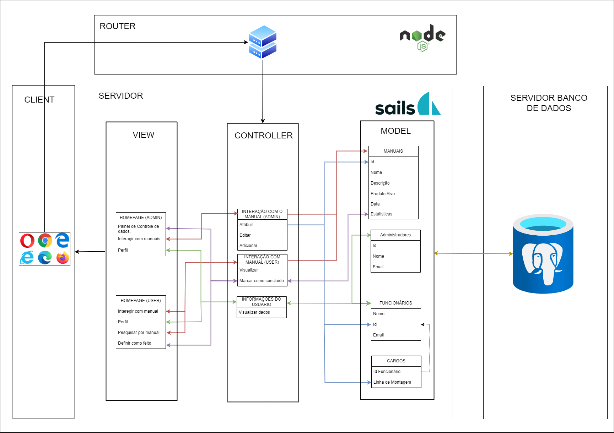

# MVC-DIVE

## Readme para Arquitetura MVC

#### Nome do Projeto: 
DIVE - Dell Interactive Virtual Environment

#### Descrição: 
O DIVE é uma plataforma de treinamento para divulgar e a disponibilizar materiais técnicos (manuais) sobre o processo de
montagem de diferentes produtos da DELL.

#### Arquitetura: 
MVC (Model-View-Controller)

#### Ferramenta de Diagramação: 
draw.io

## Modelos (Models):

### Entidades e Atributos:

#### Manuais:
- **Descrição:** A entidade manuais define informações importantes a respeito dos manuais.
  
  - Id: vincula ao manual um código único aleatório, possibilitando que ele seja identificado individualmente.
  - Nome: o nome dado ao manual, uma forma mais intuitiva de encontrar manuais.
  - Produto Alvo: apresenta a que produto se destina tal manual, facilita buscas.
  - Data: momento que o manual foi publicado.
  - Estatísticas: quantidade de acessos, quem acessou. Informações importantes para os admins (há a possibilidade de que haja diferentes atributos para estatísticas).

#### Administradores:
- **Descrição:** A entidade administradores lista os administradores, aqueles que podem manejar e alterar manuais, informando seus dados e informações relevantes.
  
  - Id: assim como os manuais, administradores terão IDs para identificação.
  - Nome: nome do Admin.
  - Email: usado para login e possíveis notificações.

#### Funcionários:
- **Descrição:** A entidade funcionários lista os montadores, informando seus dados e informações relevantes.
  
  - Id: usados para identificação individual de cada montador, será único.
  - Nome: nome do montador.
  - Email: usado para login e possíveis notificações.

#### Cargos:
- **Descrição:** A entidade cargos define em qual linha de montagem cada montador trabalha.
  
  - Id funcionário: Aqui, o ID do funcionário é descrito, para identificação.
  - Linha de Montagem: A partir do ID, a linha de montagem é atribuída a um determinado funcionário.

#### Relação entre entidades Cargos e Funcionários:
- A tabela "cargos" possui um atributo chamado "id_montador", que é uma chave estrangeira.
- Essa chave estrangeira está vinculada ao atributo "id" da tabela "montadores".
- Isso significa que cada registro na tabela "cargos" está associado a um montador específico na tabela "montadores".
- Essa relação é uma associação de um para muitos (um montador pode ter vários cargos, mas um cargo pertence a apenas um montador).

## Controladores (Controllers):

### Lista de Controladores:

#### Interação com o Manual (admin):
- Ao selecionar o manual, ocorre a identificação de seu ID, que se torna um parâmetro para a ocorrência do método. Dessa forma, a opção de atribuir aparece, gerando uma lista com os montadores e possibilitando que esse manual seja enviado para um montador específico.
- Editar: Ao selecionar um manual, é gerada a possibilidade de editar seu conteúdo. Isso ocorre por meio da execução de um método que obtém o ID desse manual e realiza as alterações necessárias, gerando, ao final, um novo ID para essa versão atualizada.
- Adicionar: Na lista de manuais, ao clicar no botão de adicionar (+), o método de adicionar manual é acionado, permitindo que sejam adicionados a ele arquivos multimídia. Isso resulta na criação de um novo manual com um ID único.

#### Interação com o Manual (user):
- Visualizar: Ao clicar em um manual, seu ID é capturado, gerando a possibilidade de acessar seu conteúdo, que inclui arquivos multimídia e informações relevantes.
- Marcar como Concluído: Ao terminar de ler cada manual, um botão "Marcar como concluído" aparece, capturando o ID do manual e direcionando-o para uma tabela de manuais concluídos.

#### Informação de Dados:
- Visualizar Dados: Ao clicar no botão perfil, a partir do ID do usuário, seus dados relevantes aparecem em tela.

## Views (Views):

### Lista de Views:

#### Homepage User: 
- Nessa tela, aparecerá a listagem de manuais, em ordem de prioridade de leitura. Ao clicar, pop-ups aparecerão com informações de manuais.

#### Homepage Admin: 
- Nessa tela, aparecerão a listagem de manuais e uma dashboard com informações relevantes do acesso às informações pelos funcionários. Ao clicar, pop-ups aparecerão com informações.

## Infraestrutura:

### Componentes de Infraestrutura:

#### Banco de Dados Postgres:
- Banco de dados relacional utilizado para armazenar os dados do sistema, como informações de manuais, usuários e outras entidades.
  
#### Node.js:
- Plataforma de desenvolvimento server-side que utiliza a linguagem JavaScript. Utilizamos o Node.js para desenvolver a lógica de negócios do sistema, incluindo os controladores e modelos MVC.
  
#### Sails.js:
- Framework MVC para Node.js, utilizado para o desenvolvimento da camada de controle (controllers) e camada de visualização (views) do sistema.
  
#### HTML, CSS e JavaScript:
- Linguagens de marcação e estilização utilizadas para criar a interface do usuário (UI) do sistema. HTML é usado para estruturar o conteúdo, CSS para estilização e JavaScript para interatividade e comportamento dinâmico na página.

#### Render:
- Ferramenta utilizada para renderização de templates HTML dinâmicos, permitindo a geração de páginas web com conteúdo personalizado com base nos dados fornecidos pelo servidor.

### Integração com a Arquitetura MVC:

- O Node.js fornece a base para a aplicação, gerenciando o servidor e controlando o fluxo de solicitações.
- O Sails.js é utilizado para estruturar a aplicação seguindo o padrão MVC, com os modelos definindo a estrutura dos dados, os controladores lidando com a lógica de negócios e as views sendo responsáveis pela interface do usuário.
- O banco de dados Postgres é utilizado como fonte de dados, integrando-se aos modelos do Sails.js para armazenar e recuperar informações conforme necessário.
- As linguagens HTML, CSS e JavaScript são usadas para criar as interfaces do usuário, com o Render permitindo a renderização dinâmica de templates HTML com base nos dados do servidor, integrando-se à estrutura MVC do Sails.js.

## Implicações da Arquitetura:

- **Escalabilidade:**
  A arquitetura MVC permite uma boa escalabilidade do sistema, pois divide a aplicação em três componentes principais (Model, View, Controller), facilitando a adição de novos recursos e a modificação de partes específicas do sistema sem afetar as outras partes. Isso significa que novas funcionalidades podem ser facilmente adicionadas ao sistema sem a necessidade de reestruturação completa.

- **Manutenção:**
  A separação clara de responsabilidades entre os modelos, as views e os controladores facilita a manutenção do sistema. Como cada componente tem uma função específica, é mais fácil entender e modific

